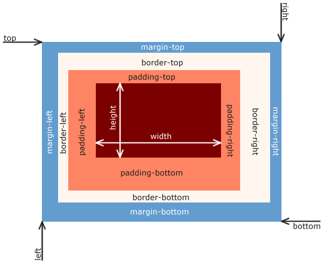

# #100Devs
## [Class 04](https://youtu.be/am0AJKadNJ0?si=vg3ABjOGFrVJEBNE) notes

Agenda: 15:25
* review - CSS fundamentals
* review - specificiy
* review - Relationshio Selectors
* learn - Box Model
* learn - simple layout
* Lab -Create a simple layout
* lab - 3 simple layouts

**The Golden Rule: seperation of concerns**
* HTML = Content / Structure
* CSS = Style
* JS = Behavior / Interaction

**Where does CSS go?**
* Inline (for email)
* In the head (It's called critical path CSS or critical CSS)
* in a separate file (most of the time CSS is in a separate file!)

**CSS break down:**
The whole thing is called a **rule**. The `p` is called a **selector**. It is followed by a set of **declarations** in a **declaration block**.
```
p {
  color: red;
  font-weight: bold;
}
```

The **cascade** in CSS: CSS is read top to bottom. What comes below can override what came above, if the rules below have equal or greater **specificity**.

**Specificity is the rule the browser uses to decide which CSS style “wins” when multiple rules target the same element.**

### The specificity hierarchy (from weakest to strongest)

Browsers rank selectors by **how specific** they are:

1. **Type selectors** (lowest)
   Examples: `div`, `p`, `button`

2. **Class selectors / attributes / pseudo-classes**
   Examples: `.card`, `[type="text"]`, `:hover`

3. **ID selectors**
   Examples: `#header`, `#main`

4. **Inline styles**
   Example: `style="color: red"`

5. **`!important`** (override mechanism, not true specificity)

Higher levels always beat lower ones, regardless of order.

### How specificity is actually calculated

Specificity is commonly written as a **4-part value**:

```
(a, b, c, d)
```

* **a** → Inline styles
* **b** → Number of IDs
* **c** → Number of classes, attributes, pseudo-classes
* **d** → Number of element selectors, pseudo-elements

The browser compares these **left to right**, like numbers.

---

#### Example: which rule wins?

```css
p {
  color: blue;
}

.article p {
  color: green;
}

#content p {
  color: red;
}
```

Specificity values:

* `p` → (0,0,0,1)
* `.article p` → (0,0,1,1)
* `#content p` → (0,1,0,1)

**Winner:** `#content p` → red

IDs beat classes and elements.

#### Examples: how many specificity does the following CSS rule have?
1. 
```
<section>
  <p class="robot unicorn">Hello world</p>
  <p id="zebra" class="bob">Hello youtube</p>
  <p class="bob">Goodbye mixer</p>
</section>
```

```
p.robot.unicorn {
  color: red;
}
```
This rule has specificity value of (0,0,2,1).

2.
```
<section id="dietCoke">
  <p class="robot unicorn">Hello world</p>
  <p id="zebra" class="bob dominoPizza">Hello youtube</p>
  <p class="bob">Goodbye mixer</p>
</section>
```

```
#dietCoke .dominoPizza {
  color: red;
}
```
The specificity value is (0,1,1,0)

3.
```
.class1 .class2 {
}
```
When there is a space between the 2 classes, it means a **parent-child relationship**. The rule applies for .class2 that is a child (not neccessarily direct child though) to .class1.
```
.class1.class2 {
}
```
When there is no space between the 2 classes, it means an element that has both classes! This is NOT a parent-child relationship.

No class name can have a space in the name. If there is a space in the class name, it means these are 2 different classes.

**Camo case**: the first word is lowercase, the following words have their first letter capitalized.

4.
```
<section id="dietCoke">
  <p class="robot unicorn">Hello world</p>
  <p id="zebra" class="bob dominoPizza">Hello youtube</p>
  <p class="bob">Goodbye mixer</p>
</section>
```

```
.bob {
  color: red !important;
}
```
The specificity value is (1,0,1,0)

---


### How to research?
* **Use the MDN**
* Use [https://learn.shayhowe.com/html-css/](https://learn.shayhowe.com/html-css/)

### Selecting by relationship
* To select an element that is the direct descendent of another element use: **parent > child**
html:
```
<section>
    <p>hello world</p>
</section>
```

CSS:
```
section > p {
    color: red;
}
```
`>` will apply the rule to the paragraph`p` that is the direct child of `section`. The `p` has to be the direct child (1-level below only).

* To select an element that is inside of another element without being directly descended use parent element: **parent child**. 
html:
```
<section>
    <article>
        <p>hello world</p>
    </article>
</section>
```

CSS:
```
section p {
    color: red;
}
```
* To select an element that is the next silibing use: **previous sibling + next sibling** (the siblings are on the same level).
html:
```
<section>
    <p>hello world</p>
    <p>hello youtube</p>
</section>
```

CSS:
```
p + p {
    color: red;
}
```
This will make the second `p` red! (but not affect the first `p`)

### IDs & Classes
**IDs** are used for selecting distinct elements. Only 1 ID with the same value per document. Use `#idName {}` in CSS to refer to that `idName`. We cannot re-use that same ID name anywhere else in the same document.

html:
```
<section>
  <p> hello world</p>
  <p id="zebra">hello youtube</p>
</section>
```

CSS:
```
#zebra {
  color: red;
}
```

**Classes** are for selecting multiple elements at the same time. Multiple with the same values allowed per document. Use `.className {}` in CSS to refer to that `className`. An element can have multiple classes!

Example 1:
html:
```
<section>
  <p class="robot">hello world</p>
  <p id="zebra" class="bob">hello youtube</p>
  <p class="bob">goodbye mixer</p>
</section>
```

CSS:
```
.bob {
  color: red;
}
```

### The Box Model


### Layouts
#### Floats
Note that floats are outdated. It is recommended to use **Flexbox and CSS Grid** now. **Flexbox and CSS Grid** are better way to do things now. 

By default (`box-sizing: content-box`), the width in CSS doesn't include padding and border. We can use `box-sizing: border-box;` in CSS to change how the total width and height of an element are calculated. With `border-box`, the specified `width` and `height` of an element include the content, padding, and border, resulting in more intuitive and predictable layouts. 

The CSS declaration `clear: both;` specifies that an element must be moved below any preceding floated elements, whether they are floated to the left or the right. It effectively prevents the element from sitting next to any floats and pushes it down to start on a new line. 


#### Layouts: the big picture

In software development, **layout** refers to how elements are positioned and sized on the screen and how they respond to different screen sizes. Layout is not just visual design—it directly affects usability, accessibility, maintainability, and performance. Over time, CSS layout techniques evolved as web applications became more complex. Each major layout method reflects the needs and constraints of its era.

#### Float: the legacy layout tool

**Floats** were originally designed to allow text to wrap around images, not to build full-page layouts. Developers later repurposed them to create multi-column designs because there were no better tools at the time. With floats, elements are taken out of the normal document flow and pushed to the left or right, while surrounding content wraps around them.

In practice, float-based layouts were fragile and difficult to maintain. They required “clearfix” hacks to prevent parent elements from collapsing, and small changes often broke the layout in unexpected ways. From a software engineering standpoint, floats are a historical solution, not a modern one. Today, you should understand floats mainly so you can read and maintain older codebases.

#### Flexbox: layout for components and one-dimensional flow

**Flexbox** was introduced to solve common alignment and spacing problems in a clean, predictable way. It is designed for one-dimensional layouts, meaning you control layout in either a row or a column at a time. Flexbox excels at distributing space, aligning items, and handling dynamic content sizes.

In modern software development, Flexbox is the default choice for component-level layout. Navigation bars, toolbars, cards, modals, and form controls are all excellent Flexbox use cases. Its mental model is simple: a container defines how its children flow, align, and grow or shrink. This makes Flexbox ideal for reusable UI components and responsive design.

#### CSS Grid: layout for pages and two-dimensional structure

**CSS Grid** was created to handle two-dimensional layouts, where both rows and columns matter simultaneously. It allows developers to define an explicit grid structure and place elements precisely within that grid. Unlike floats or Flexbox, Grid was designed from the start for page-level layout.

In real-world software projects, Grid is best for overall page structure: headers, sidebars, main content areas, dashboards, and complex responsive layouts. Grid lets you describe layout intent directly in CSS, which improves readability and reduces layout bugs. It also makes responsive design more declarative and easier to reason about.

#### How Flexbox and Grid work together in practice

In professional codebases, Flexbox and Grid are not competitors—they are complementary. A common pattern is to use CSS Grid for the outer page layout and Flexbox inside components. Grid defines where major sections live, while Flexbox handles alignment and spacing within those sections.

This separation mirrors good software design principles: Grid sets the architecture, and Flexbox handles the implementation details.

#### Modern layout decision guide
From an engineering standpoint, the decision usually looks like this:
* Use Flexbox when laying out items in a single direction (row or column)
* Use Grid when you need control over both rows and columns
* Avoid floats for layout in new code
* Combine Grid and Flexbox for clean, scalable systems

#### Final mental model
Think of layout systems like tools in a codebase:
* **Float** is legacy code you maintain but don’t write new features with
* **Flexbox** is your everyday utility for building components
* **CSS Grid** is your architectural tool for structuring entire pages

